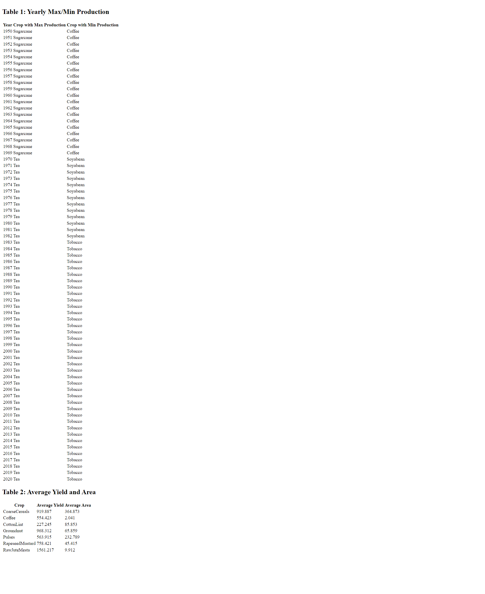

1. Set Up the Project Environment with Yarn

# Create a new React application
yarn create react-app indian-agriculture-analytics

# Navigate to the project directory
cd indian-agriculture-analytics

2. Clean Up the CRA Template

Remove unused files and code:
Delete src/logo.svg, src/App.test.js, src/reportWebVitals.js, src/setupTests.js  

Clean up src/App.css and src/index.css

Modify src/index.js and src/App.js to remove unnecessary imports and code

3. Install Mantine and Other Required Packages
yarn add @mantine/core @mantine/hooks

4. Load and Preprocess the Indian Agriculture Dataset

Create a folder named data and place the dataset file (e.g., agriculture_data.csv) inside it.

Use a suitable library to load and process the CSV data. 

5. Running the Project

yarn start

OUTPUT
